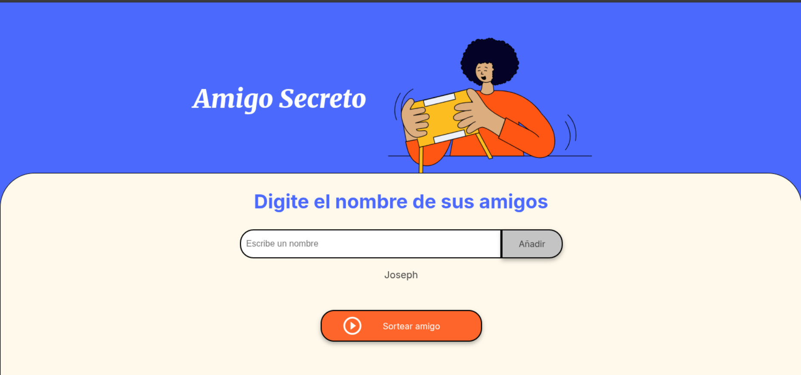
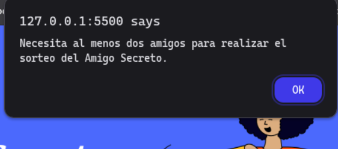
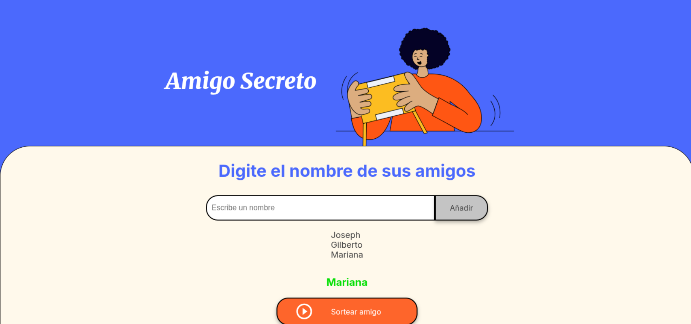

# Sorteo del Amigo Secreto 🎁

쯈uieres realizar un sorteo para conocer qui칠n será tu **amigo secreto**?

1. Escribe el nombre de cada participante y presiona el botón *Añadir*.

2. Debes tener al menos 2 participantes para poder realizar el sorteo.

3. Una vez que tengas a todos los participantes agregados, presiona el botón *Sortear amigo*, y se mostrará tu **amigo secreto**.

